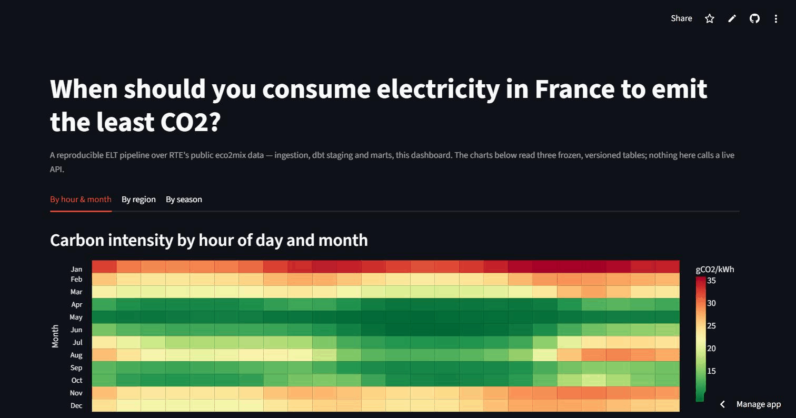
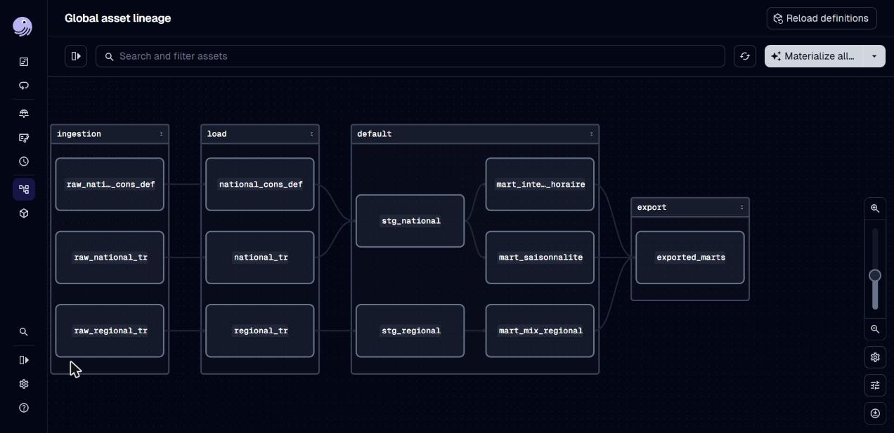
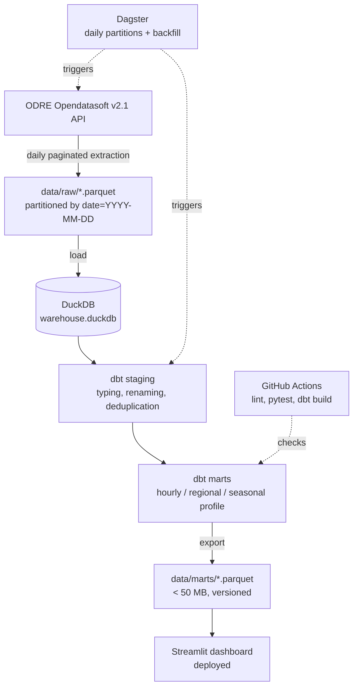

# eco2mix-elt

[](https://github.com/Evanguennou29/eco2mix-elt/actions/workflows/ci.yml)

A reproducible ELT pipeline answering when French electricity is cleanest.

## Demo



**Live dashboard:** https://eco2mix-elt-h7xesyj8z8smnyo34ezqhz.streamlit.app/
(free-tier Streamlit Cloud app — see [Known limitations](#known-limitations) if it's asleep).

Dagster's asset graph, with the daily partitions it backfills:



## The question

At what time should you consume electricity in France to emit the least CO₂ —
and does the answer change by region and by season? Three findings, read
straight off the marts below:

1. **Hour and month matter a lot.** Nationally, the cleanest slot is a June
   afternoon (13h, ~8 gCO₂/kWh); the dirtiest is a January evening (20h,
   ~36 gCO₂/kWh) — over **4x higher**.
2. **Region matters just as much.** Auvergne-Rhône-Alpes draws ~74% of its
   generation from nuclear and ~20% from hydro; Bretagne draws 0% from
   nuclear and ~22% from thermal plants — the cleanest hour to consume is
   not the same nationwide.
3. **Winter is roughly twice as dirty as spring.** National carbon intensity
   averages 28.3 gCO₂/kWh in winter versus 14.1 in spring, the cleanest
   season — about a **100% gap**.

## Why this exists

RTE publishes quarter-hourly consumption, generation by source, and carbon
intensity for France, nationally and by region, going back years — for free,
without an API key. That data is public but not directly usable: it's split
across three datasets with different histories and revision cadences, needs
typing and deduplication, and doesn't answer "when" until it's aggregated by
hour, region, and season. This repository turns it into three tables that
do, orchestrated so it stays current, and a dashboard so the answer is a
link, not a notebook.

## Architecture



The dashboard never talks to the API, DuckDB, or Dagster — it reads three
small, frozen, versioned Parquet files under `data/marts/`. A demo link that
depends on a live API call or a multi-GB warehouse file is a demo link that
eventually breaks or can't be hosted on a free tier; a handful of Parquet
files checked into git can't.

## Quickstart

**Docker (recommended — runs the orchestrator and the dashboard together):**

```bash
git clone https://github.com/Evanguennou29/eco2mix-elt.git && cd eco2mix-elt
cp .env.example .env
docker compose up
```

Dagster is then at `localhost:3000`, the dashboard at `localhost:8501`.

**Local (Python 3.11):**

```bash
pip install -e ".[dev]"
python -m eco2mix ingest --start 2024-01-01 --end 2024-01-07 && python -m eco2mix load && (cd dbt && dbt build --profiles-dir .) && python -m eco2mix export
streamlit run app/main.py
```

## Data

| Dataset | Grain | Used for |
|---|---|---|
| [`eco2mix-national-cons-def`](https://opendata.reseaux-energies.fr/explore/dataset/eco2mix-national-cons-def/information/) | National, quarter-hourly | Settled history (consumption, generation by source, `taux_co2` carbon intensity) |
| [`eco2mix-national-tr`](https://opendata.reseaux-energies.fr/explore/dataset/eco2mix-national-tr/information/) | National, quarter-hourly | Rolling recent window, same fields, not yet settled |
| [`eco2mix-regional-tr`](https://opendata.reseaux-energies.fr/explore/dataset/eco2mix-regional-tr/information/) | 12 mainland regions, quarter-hourly | Generation mix by region and filière |

Source: Open Data Réseaux Énergies (ODRÉ), `opendata.reseaux-energies.fr`,
via the Opendatasoft Explore v2.1 API — no API key required. Licence:
**Licence Ouverte v2.0 (Etalab)** for all three datasets.

**Revision caveat:** ODRÉ replaces a month's "temps réel" (`-tr`) readings
with "consolidée" data the following month, then "définitive" a year later —
so the pipeline re-ingests recent periods on every run instead of only
appending, or it would keep serving stale numbers for dates that have since
been corrected upstream.

The marts currently checked into `data/marts/` are built from a real
pipeline run: national figures from `eco2mix-national-cons-def`
(2024-01-01 through 2026-06-30, the full settled history available) unioned
with `eco2mix-national-tr`'s rolling window (2026-07-01 onward) for a
continuous series; regional figures from `eco2mix-regional-tr`'s own
rolling window only (see [Known limitations](#known-limitations)).

## Project layout

```
src/eco2mix/       # ingestion client, CLI (ingest | load | export), config
dbt/models/        # staging (typed, deduplicated) -> marts (the 3 answers)
orchestration/      # Dagster assets, daily partitions, backfill
app/                 # Streamlit dashboard, reads only data/marts/
data/marts/          # versioned Parquet the dashboard reads, < 50 MB
tests/               # pytest, all against frozen fixtures, no network calls
```

## Data quality

47 dbt tests run on every `dbt build`, generic and business:

- `not_null` / `unique` / `accepted_values` on keys, filières, and regions.
- `no_gap_over_24h` — fails if two consecutive readings of a series are more
  than 24h apart, catching a partial or botched ingestion before it reaches
  a mart.
- `filiere_sum_matches_balance` — fails if summed generation plus net
  exchanges strays more than 10% from consumption, catching a missing
  filière, a fanned-out join, or a unit mismatch.
- `filiere_sum_matches_region_total` — cross-checks `mart_mix_regional`'s
  own aggregation against an independently computed regional total.

These aren't decorative: while building `mart_mix_regional`, the fixtures
turned out to have an internally inconsistent energy balance (invented
`ech_physiques` values), which would have made the balance test pass only on
a loose tolerance rather than a real check — the fixtures were recomputed
from `consumption - sum(filière productions)` before the test was trusted.
Both business tests are also verified to actually fail on deliberately
broken data (a 48h gap, a mismatched balance), not just pass on good data.

## Known limitations

- **No regional carbon intensity.** RTE's `taux_co2` signal is published
  only on the national datasets, not on `eco2mix-regional-tr` — verified
  against the real API schema. Estimating one from the regional mix and
  emission factors would be a modelling exercise this pipeline deliberately
  avoids (same "no forecasting, no ML" boundary as the rest of the project).
- **`eco2mix-regional-tr` has a short history.** Unlike the national data,
  it has no consolidated/definitive counterpart in ODRÉ's catalog, so the
  regional mart is built from that dataset's rolling window only —
  currently a couple of months, not the multi-year span the national marts
  cover.
- **The dashboard can be asleep.** It's hosted on Streamlit Community
  Cloud's free tier, which puts unvisited apps to sleep; the first load
  after a period of inactivity can take up to a minute to wake it.
- No forecasting, no machine learning model — a different portfolio project.
- No real-time streaming: the pipeline runs at a daily cadence.
- No countries other than France, no market or price data.
- No paid cloud deployment: DuckDB as a file, dashboard on a free tier.

## Licence

Code: MIT (see [`LICENSE`](LICENSE)). Data: Licence Ouverte v2.0 (Etalab),
per dataset above.
