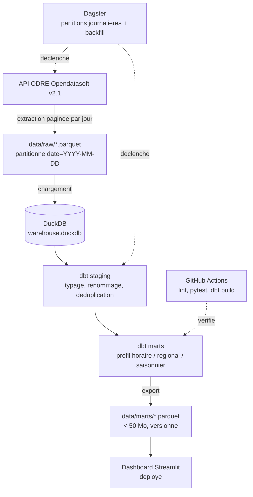

# Spécification — `eco2mix-elt`

**Projet A du portfolio : pipeline ELT orchestré + dashboard analytique.**
Document à donner tel quel à Claude Code. Chaque lot correspond à une PR.

---

## 1. Problème et périmètre

### La question

> **À quelle heure faut-il consommer de l'électricité en France pour émettre le moins de CO₂ — et est-ce que la réponse change selon la région et la saison ?**

C'est une question à laquelle personne ne peut répondre de tête, dont la réponse est utile (pilotage de charge, recharge de véhicule électrique, effacement industriel), et pour laquelle la donnée publique existe au pas quart d'heure depuis 2012. Le dépôt existe pour y répondre de façon reproductible.

### Ce que le dépôt prouve

| Compétence | Où elle est visible |
|---|---|
| Ingestion d'API paginée, idempotente, avec reprise | `src/eco2mix/ingest/` |
| Modélisation analytique en couches | `dbt/models/staging` → `marts` |
| Qualité de données testée, pas déclarée | tests dbt + `pytest` |
| Orchestration avec partitions et backfill | `dagster/` |
| Restitution avec une conclusion, pas juste des courbes | `app/` déployé |
| Reproductibilité | `docker compose up` |

### Dans le périmètre

- Ingestion des jeux ODRÉ `eco2mix-national-tr`, `eco2mix-national-cons-def` et `eco2mix-regional-tr` (API Opendatasoft Explore v2.1, sans clé).
- Historique consolidé de 2015 à aujourd'hui + rafraîchissement quotidien incrémental.
- Trois marts répondant chacun à un angle de la question : profil horaire, écart régional, saisonnalité.
- Dashboard déployé publiquement, avec trois conclusions écrites en toutes lettres.

### Hors périmètre — à écrire explicitement dans le README

- **Aucune prévision, aucun modèle de ML.** C'est un autre projet du portfolio, pas celui-ci.
- Pas de streaming temps réel : le pas est journalier.
- Pas d'autres pays, pas de données de marché ou de prix.
- Pas de déploiement cloud payant : DuckDB en fichier, dashboard sur palier gratuit.

### Source et licence

- Plateforme : Open Data Réseaux Énergies (ODRÉ), `opendata.reseaux-energies.fr`, données RTE.
- Accès : API Opendatasoft Explore v2.1, **sans clé d'API**.
- Licence : Licence Ouverte / Open Licence — à vérifier et citer précisément dans le README, avec le lien vers chaque jeu de données.
- Piège à documenter : les données « temps réel » du mois M sont remplacées par des données « consolidées » en M+1, puis « définitives » en A+1. Le pipeline doit donc **réingérer** les périodes récentes, pas seulement ajouter. C'est exactement le genre de subtilité métier qu'un lead technique remarque.

---

## 2. Architecture



Le point important de ce schéma : **le dashboard ne parle jamais à l'API**. Il lit un mart figé et versionné. C'est ce qui garantit qu'un lien de démo ne meurt pas, et c'est un choix à justifier dans le README.

---

## 3. Arborescence

```
eco2mix-elt/
├── README.md
├── LICENSE                        # MIT
├── pyproject.toml                 # Poetry ou uv, Python 3.11
├── docker-compose.yml
├── Dockerfile
├── .env.example
├── .gitignore                     # data/raw/, *.duckdb, .dagster/
├── Makefile                       # make ingest / make build / make app / make test
├── src/
│   └── eco2mix/
│       ├── __init__.py
│       ├── config.py              # dataclass de config, lecture .env
│       ├── ingest/
│       │   ├── client.py          # client HTTP: pagination, retry, timeout
│       │   ├── datasets.py        # definition des 3 jeux ODRE + champs retenus
│       │   └── runner.py          # extraction d'une plage de dates -> parquet
│       ├── load.py                # parquet -> DuckDB (tables raw_*)
│       └── cli.py                 # entrypoint: ingest | load | build | export
├── dbt/
│   ├── dbt_project.yml
│   ├── profiles.yml               # profil duckdb, chemin relatif
│   └── models/
│       ├── staging/
│       │   ├── stg_national.sql
│       │   ├── stg_regional.sql
│       │   └── schema.yml         # tests: not_null, unique, accepted_values
│       └── marts/
│           ├── mart_intensite_horaire.sql
│           ├── mart_mix_regional.sql
│           ├── mart_saisonnalite.sql
│           └── schema.yml         # tests metier + descriptions
├── orchestration/
│   └── definitions.py             # assets Dagster, DailyPartitionsDefinition
├── app/
│   ├── main.py                    # Streamlit
│   └── charts.py
├── data/
│   ├── raw/                       # gitignore
│   └── marts/                     # versionne, < 50 Mo
├── tests/
│   ├── fixtures/                  # reponses API figees, 2 jours
│   ├── test_client.py
│   ├── test_runner.py
│   └── test_pipeline_integration.py
├── notebooks/
│   └── 00_exploration.ipynb       # exploration seulement, jamais le livrable
└── .github/
    └── workflows/
        └── ci.yml
```

---

## 4. Plan du README (en anglais)

1. **Title + one-line pitch** — « A reproducible ELT pipeline answering when French electricity is cleanest. »
2. **Demo** — animated GIF of the dashboard + live link, immediately after the pitch.
3. **The question** — the three findings, stated as sentences with numbers. This is the section a recruiter actually reads.
4. **Why this exists** — the data is public but unusable raw; three datasets, quarter-hourly, revised over time.
5. **Architecture** — the Mermaid diagram + one paragraph on the design decision (frozen mart, no live API call from the dashboard).
6. **Quickstart** — exactly three commands, `docker compose up` path and local path.
7. **Data** — datasets used, licence, link, refresh cadence, and the consolidation caveat.
8. **Project layout** — short tree with one line per directory.
9. **Data quality** — what the dbt tests check and what they caught.
10. **Known limitations** — regional carbon estimates, revision lag, what is out of scope.
11. **Licence** — MIT for the code, source licence for the data.

Règles : pas un seul chiffre qui ne sorte pas d'une exécution réelle. Pas de section « Future work » longue — deux lignes maximum, sinon ça se lit comme un projet inachevé.

---

## 5. Découpage en lots

Un lot = une PR = un état du dépôt qui tourne. Rien n'est mergé si la CI est rouge.

**Lot 0 — Squelette (½ j)**
`pyproject.toml`, `.gitignore`, `LICENSE` MIT, `ruff` + `pytest` configurés, CI qui lint et lance un test trivial, README stub avec le pitch. *Critère : la CI est verte sur un dépôt vide.*

**Lot 1 — Ingestion (1 j)**
Client HTTP avec pagination, timeout, retry exponentiel. `runner.py` extrait une plage de dates vers Parquet partitionné. CLI `python -m eco2mix ingest --start 2024-01-01 --end 2024-01-07`. Relancer sur la même plage doit réécrire proprement, pas dupliquer. *Tests : pagination, gestion d'une réponse vide, idempotence.*

**Lot 2 — Chargement + staging (1 j)**
`load.py` charge le Parquet dans DuckDB. Modèles dbt de staging : typage, renommage en snake_case anglais, déduplication sur (horodatage, périmètre). Tests dbt `not_null`, `unique`, `accepted_values` sur les filières. *Critère : `dbt build` passe sur 7 jours de données.*

**Lot 3 — Marts (1 j)**
Les trois marts. `mart_intensite_horaire` : intensité carbone moyenne par heure et par mois. `mart_mix_regional` : part de chaque filière par région. `mart_saisonnalite` : écart été/hiver. Tests métier — par exemple, la somme des filières doit approcher la production totale à une tolérance près. Descriptions dbt remplies, `dbt docs` génère quelque chose de lisible. *Critère : les trois conclusions du README sont formulables à partir de ces tables.*

**Lot 4 — Dashboard + export (1 j)**
Export des marts en Parquet dans `data/marts/`. App Streamlit qui les lit, trois onglets, un texte de conclusion par onglet. Déploiement sur Streamlit Community Cloud. *Critère : le lien public fonctionne depuis une navigation privée.*

**→ À ce stade le dépôt est publiable et épinglable.** Si ton temps se réduit, arrête-toi ici et passe au projet suivant.

**Lot 5 — Orchestration (1 j)**
Assets Dagster avec `DailyPartitionsDefinition`, backfill sur l'historique, une sensor ou un schedule quotidien. `docker compose up` lance Dagster + le dashboard. Une capture de l'UI Dagster dans le README. *Critère : un backfill de 30 jours se relance sans doublon.*

**Lot 6 — Finition (½ j)**
README définitif, GIF de démo, description et topics GitHub (`data-engineering`, `dbt`, `duckdb`, `dagster`, `open-data`, `energy`), épinglage sur le profil, et la ligne à ajouter dans la section Projets du CV.

**Total : 5,5 à 6 j-h.** À 5-10 h par semaine, compte 5 à 6 semaines pour tout, ou **3 semaines pour le dépôt publiable au lot 4**.

---

## 6. Tests et CI

### Tests Python (`pytest`)

- `test_client.py` — pagination sur réponses figées, retry sur 429/500, timeout.
- `test_runner.py` — découpage en fenêtres de dates, idempotence de la réécriture, colonnes du Parquet produit.
- `test_pipeline_integration.py` — le pipeline complet sur 2 jours de fixtures, sans appel réseau, jusqu'aux marts. C'est le test qui rassure un lead technique.

**Aucun test ne doit appeler l'API réelle.** Les fixtures sont des réponses JSON figées dans `tests/fixtures/`.

### Tests dbt

Génériques : `not_null` et `unique` sur les clés, `accepted_values` sur les filières et régions, `relationships` entre staging et marts. Métier : cohérence production totale vs somme des filières, absence de trous supérieurs à 24 h dans la série.

### `.github/workflows/ci.yml`

Déclenché sur `push` et `pull_request`. Étapes :

1. checkout, setup Python 3.11, cache des dépendances
2. `ruff check` et `ruff format --check`
3. `pytest`
4. `dbt build` sur une base DuckDB construite depuis les fixtures
5. badge de statut dans le README

Un job planifié séparé (`schedule`, quotidien) peut faire tourner l'ingestion réelle et committer le mart mis à jour — c'est une alternative légère à Dagster si le lot 5 traîne.

---

## 7. Démo

- **GIF animé** du dashboard, 10 à 15 secondes, montrant les trois onglets. Placé juste sous le pitch. C'est ce qui décide en cinq secondes si le lecteur continue.
- **Lien public** Streamlit dans le README et dans la description du dépôt.
- **Capture de l'UI Dagster** montrant les partitions remplies (après le lot 5).
- **Capture de `dbt docs`** ou du graphe de lineage, une seule image.

---

## 8. Le prompt de démarrage pour Claude Code

À coller dans une session `claude` ouverte dans le dossier du dépôt :

> Tu implémentes le projet décrit dans `SPEC.md` à la racine. Lis-le entièrement avant d'écrire une ligne.
> Contraintes : Python 3.11, pas de dépendance payante, aucun appel réseau dans les tests.
> Travaille **uniquement sur le lot 0**. Quand il est terminé et que la CI est verte, arrête-toi et fais un résumé de ce que tu as fait. Ne commence pas le lot 1 sans mon accord.
> Fais des commits atomiques et lisibles au fur et à mesure, jamais un commit unique en fin de lot.

Copie ce document dans le dépôt sous le nom `SPEC.md` avant de lancer la session.
